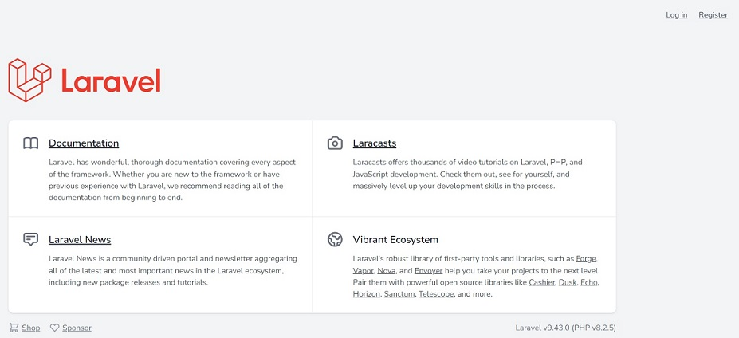

# Application for DevOps

Here is some application developed on the [Laravel](https://laravel.com) framework.

To setup this project you need to install [PHP](https://www.php.net/), [Composer](https://getcomposer.org/), [Node and NPM](https://nodejs.org/).

The configuration of the application includes the following necessary actions:

- [confirguration database](https://laravel.com/docs/10.x/database#configuration)
- `composer install` - resolve dependencies and install them
- `php artisan key:generate` - set the application key
- `php artisan migrate` - make database migrations
- `npm install` - resolve and install the application's frontend dependencies via NPM
- `npm run build` - bundle the application's assets
